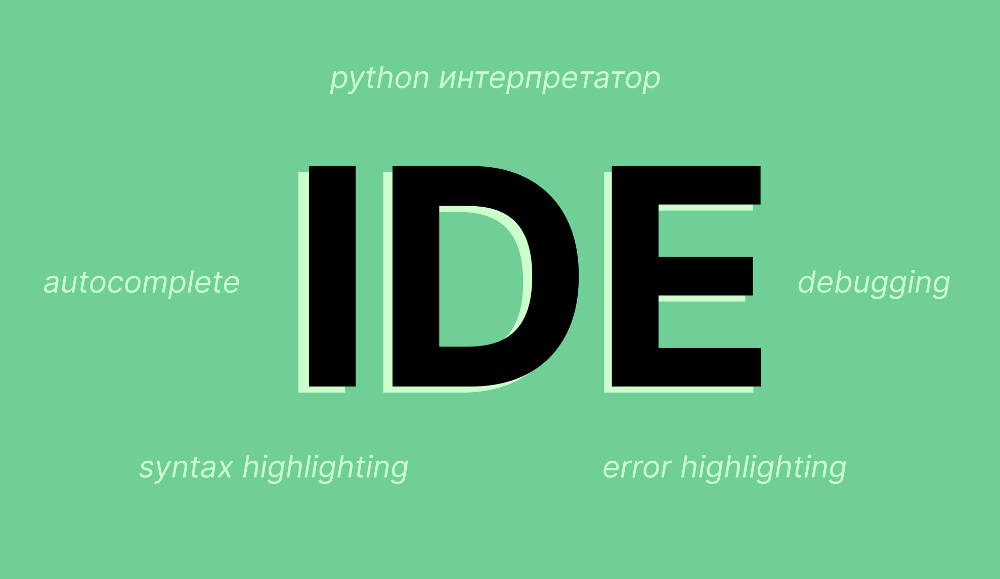
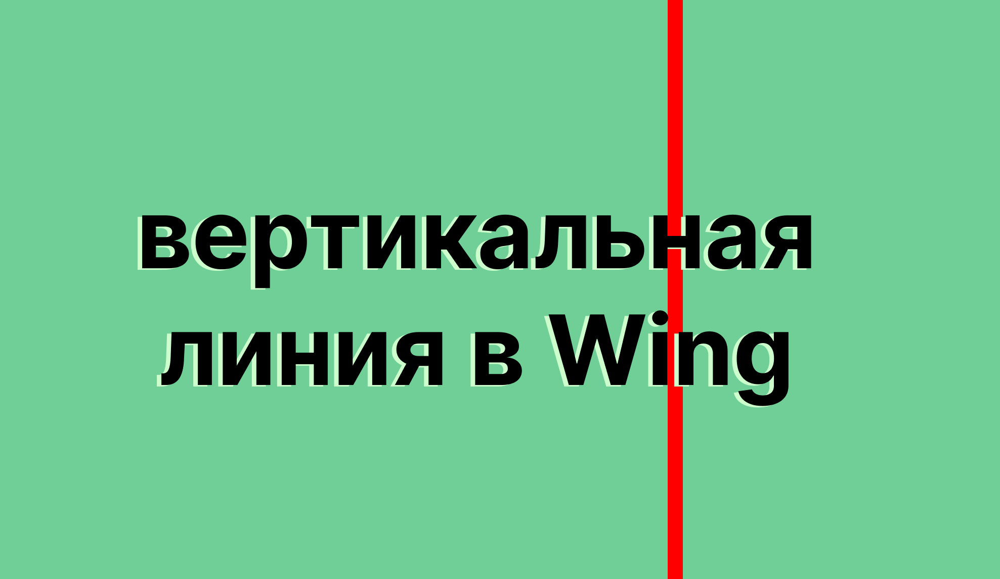
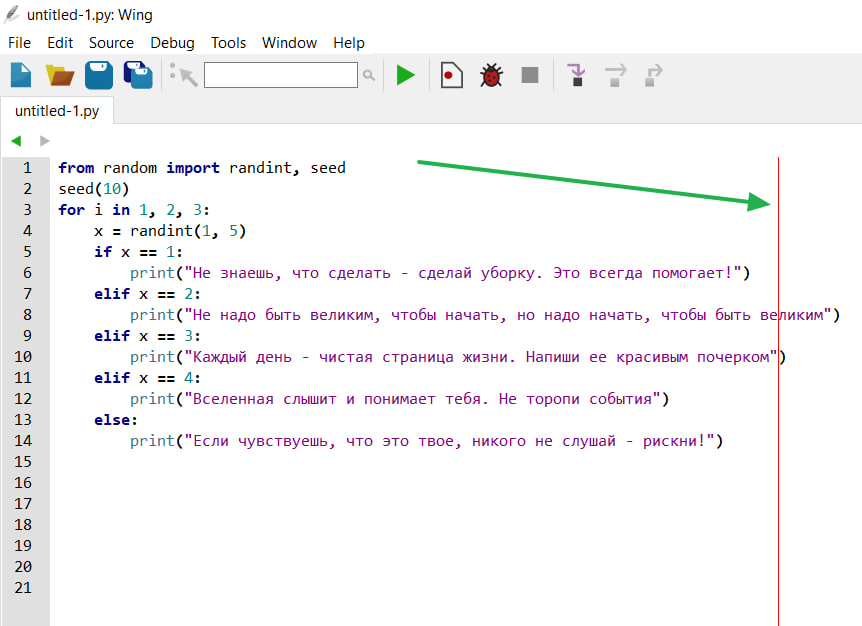
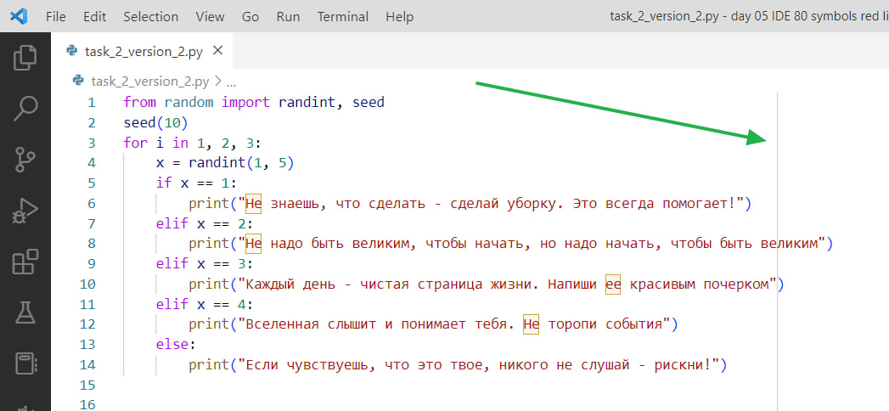
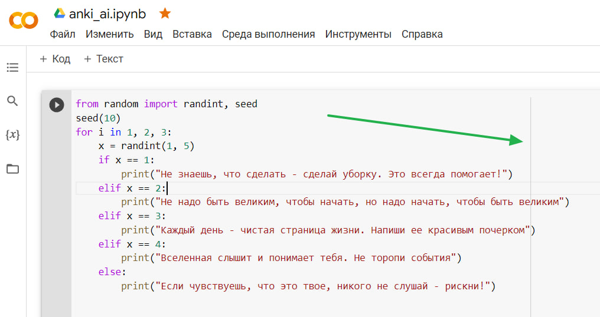

# Читаемость (readability)
- [Читаемость x PEP-8](#читаемость-x-pep-8)
- [что такое IDE?](#что-такое-ide) 
- [что такое красная вертикальная линия в IDE (в том числе в IDE Wing)?](#что-такое-красная-вертикальная-линия-в-ide-в-том-числе-в-ide-wing)
    - [Что делать, если условие и шапка функции слишком длинные?](#что-делать-если-условие-и-шапка-функции-слишком-длинные)
- [форматирование строк: все виды](#форматирование-строк)
- [форматированный вывод с помощью строковых методом: `.center .ljust .rjust`](#форматированный-вывод-методы-center-ljust-rjust)
- [f-строки вычислять, затем печать](#f-строки-вычисления-и-печать)
- [как тернарный оператор улучшает читаемость кода](#тернарный-оператор)
- [сделать большие числа `299792458` более ясными](#сделать-большие-числа-299792458-более-ясными-299_792_458)
- [что такое Git и GitHub и почему его нужно использовать на командных проектах?](#что-такое-git-и-github-и-почему-его-нужно-использовать-на-командных-проектах)
- [аннотация типов (type hints)](#type-hints)
- [линтеры как автопилот чистого кода](#линтеры-flake8)

# Мотивация

Читаемость кода — способ эффективной коммуницаии между программистами. У программистов ограничено время и внимание. Нужно взаимодействовать с программистами эффективно. Для этого нужно сделать код читаемым. 

Если вы читали книги о цифровом общении и цифровом этикете *Пиши Сокращай Ильяхова*, *Переписка 2.0* или *Цифровой Этикет Ольги Лукиновой*, то вы знаете, что такое навигация в тексте, зачем разбивать текст на абзацы и как писать текст ясно, коротко и убедительно. Аналогично нужно код оформлять так: сначала импорта, затем конспакты, затем декларирование функций, затем объявление функции `main()` и в конце кода блок `if __name__ == '__main__':`. Аналогично смысловые блоки кода разделяются в коде пробелами.  

Все советы по читаемости — это советы. Советы можно нарушать, но нужно это делать обоснованно. Например, использовать f-строки не всегда хорошо для читаемости.

# Читаемость X PEP-8

Читаемый код — код, который вы читаете так же легко, как обычный текст, написанный на 🇷🇺 или 🇬🇧 языке. Прочитайте три предложения ниже. Как вам кажется, какое предложение вы быстрее прочитаете и быстрее поймете?

```python
Пр@гРаМмИсТ ЧаСт@ ПиШеТ Пр@гРаМмЫ.
СоБаКи лЮбЯт иГрАтЬ На сВеЖеМ ВоЗдУхЕ.
Кот хочет спать на кровати.
```

Эти три примера того, как оформление влияет на скорость нашего восприятия (в частности чтения). Когда вы или другой человек читает ваш код, то оформление будет иметь такое же значение, как на примере выше.

### Почему читаемость важна?
- Если вы пишете программу в школе, на олимпиаде, в университете, на работе, то ваш код наверняка смотрят другие программисты. Например, чтобы проверить, как работает ваша программа, или добавить дополнительные возможности к вашему коду. 
- Чем более понятным и легко читаемым будет ваш код, тем быстрее и проще другие программисты будут его воспринимать. Еще легко читаемый код поможет вам быстрее вспомнить логику вашего решения задачи, которую вы решили месяц назад. Можно просто взглянуть на код и буквально прочитать его так, как вы читаете этот текст.


### Как научиться писать читаемый код?
Вам нужно два элемента:
```python
1️⃣ здравый смысл
2️⃣ набор советов по оформлению кода PEP 8
```

Для питона есть набор советов по оформлению кода [(PEP 8)](https://peps.python.org/pep-0008/): 
```python
✅ как называть переменные, функции, методы, классы; 
✅ как называть переменные-константы;
✅ как переносить длинное условие на несколько строк; 
✅ как импортировать библиотеки и отдельные функции из библиотек;
✅ в каком порядке писать импорт библиотек, функции и переменные;
```

Это несколько примеров советов. Это не строгие правила, это советы, придерживаясь которых вы сможете сделать ваш код более читаемым. 

Кстати, большинство официальных библиотек Python руководствуются именно PEP 8, начиная от фреймворка `django` для создания серверной части сайта и заканчивая библиотекой для машинного обучения `sklearn`.


# что такое IDE?
[Пройти викторину](https://forms.gle/y8GwP2nwpU4zdgbL9)

На занятиях время от времени преподаватель пишет в винге. Wing — это одна из IDE-программ. Сегодня расскажу, что такое IDE простыми словами и для чего нужна IDE.

IDE — Integrated Development Environment, интегрированная среда разработки. Звучит сложно. Разработка? Среда? Интегрированная? Давайте проще: IDE — крутой блокнот, в котором можно писать свой код на языке программирования (например, на Python) и выполнять его. Выполнить код означает перевести код в машинный язык, чтобы компьютер понял, что мы хотим от него, и сделал то, что мы хотим. Чтобы перевести код на язык компьютера, нужен переводчик. Внутри IDE есть переводчик (для питона такой переводчик называется интерпретатор).

Внутри IDE также есть подсветка синтаксиса языка. Например, названия переменных и названия команд выделяются разным цветом.

Есть подсветка ошибок, чтобы вы видели, где, например, у вас нет закрывающей скобка, где лишняя открывающая скобка. Ошибка — фрагмент кода, подчеркнутый красной линией (как в Word'е). 

Самое крутое, что есть в любой IDE — autocomplete. Это когда вы пишите какое-то слово, и IDE подсказывает варианты и дописывает его за вас, вам нужно просто нажать на клавишу Tab.

Еще внутри IDE есть еще отладка (debugger). Поэтому можно выполнять свой код пошагово.

Я перечислил некоторые преимущества IDE. Не упомянул про связь между IDE и GitHub. Но о GitHub'е в другой раз)



Вывод: 

IDE нужна для того, чтобы быстрее писать код за счет автоматического дописывания, сразу видеть мелкие ошибки в коде с помощью подсветки ошибок и выполнять свой код с помощью интерпретатора.

IDE — крутой блокнот с функциями:
```python
✅ python интерпретатор 
✅ syntax highlighting
✅ error highlighting 
✅ autocomplete
✅ debugging (отладка)
```


# что такое красная вертикальная линия в IDE (в том числе в IDE Wing)?

[Пройти викторину](https://forms.gle/h2o5HqUHR33v6Soy9)



В начале курса мы предложили вам использовать среду разработки Wing 101 (version 7.2.9). Если вы никогда раньше не программировали в IDE, то Wing — хороший и простой вариант для старта. В Wing есть красная вертикальная линия. Что это и зачем она нужна?

Для языка Python есть набор рекомендаций по тому, как сделать код более читабельным. Называется PEP 8. Среди рекомендаций в PEP 8 есть совет по максимальной длине строки. Максимальная длина строки по PEP 8 — 79 символов. Красная линия в Wing (и в других IDE; покажу на скриншотах ниже) отражает рекомендацию по тому, насколько длинными должны быть ваши строки.

Как думаете, почему следует ограничивать длину строки? (опрос 1) 👆опрос без викторины. Цель опроса — узнать ваше мнение. Правильный ответ вы узнаете позже :)


```python
ответ к первому опросу 👆

#СПОЙЛЕР
все три варианты верны!

✅ исторически сложилось: раньше мониторы были не такими широкими, как сейчас. Раньше действительно были более узкие мониторы в сравнении с современными мониторами.

✅ код будет более читабельным. Тоже верно. Не придется скроллить вправо/влево или уменьшать масштаб, чтобы увидеть весь код в ширину.

✅ можно легко сравнить две версии кода, если разделить редактор код на две колонки по горизонтали. Тоже верно. На скриншотах ниже показываю, что если соблюдать совет на максимальную длину строки в 79-80 символов, то можно легко сравнить две версии кода
```


Предполагается, что ограничение в 79 символов на строку сделает код более читабельным. Идея в том, что когда длина ограничена 79 символами, то можно с легкостью сравнить две версии кода, если разделить редактор на две колонки по горизонтали. Разделитель колонок — красная линия! Теперь вы знаете, что означает красная линия в Wing и зачем она нужна. Повторюсь, рекомендация по максимальной длине строки — это рекомендация, совет, но не правило. 

[Ссылка на набор рекомендаций по оформлению кода PEP 8.](https://peps.python.org/pep-0008/#maximum-line-length)


Если длина строки не больше 79-80 символов, то легко сравнить две версии кода без **горизонтального скроллинга**. В качестве примере взял задачу `"Печенье с предсказаниями"`. На скриншотах IDE Wing и Visual Studio Code:


Конкретно красной вертикальной линии нет в IDE  Visual Studio Code, PyCharm и Google Colab. В них либо сразу есть серые вертикальные линии, либо их нужно включить в настройках. В большинстве IDE такие линии есть. Но цвет линии может отличаться. Сути это не меняет. Такие линии служат подсказкой, насколько длинной строке следует быть. (возможно, в будущем когда вы будете работать в команде программистов, в команде будет договоренность на длину строки и на code style в целом)

Ниже приклепляю скриншоты из разных IDE 👇





## Что делать, если условие и шапка функции слишком длинные?

В команде есть договоренность по code style: длина строки не более 80 символов. Вы написали такую функцию:

```python
from random import choice  # Это команда для рандомного выбора из ...

def generate_password(length:int=10, auto_generate:bool=True, feature_digits:bool=True, feaure_uppercase:bool=True, feature_lowercase:bool=True, feautre_punctuation:bool=True):
    '''
    password generator by Клименко Илья
    '''
    DIGITS = '0123456789'
    LOWERCASE = 'abcdefghijklmnopqrstuvwxyz'
    UPPERCASE = LOWERCASE.upper()
    PUNCTUATION = '!#$%&*+-=?@^_'
    ally = DIGITS + UPPERCASE + LOWERCASE + PUNCTUATION

    chars = ''

    if auto_generate:
        chars += ally
    else:
        if feature_digits:
            chars += DIGITS
        if feaure_uppercase:
            chars += UPPERCASE
        if feature_lowercase:
            chars += LOWERCASE
        if feautre_punctuation:
            chars += PUNCTUATION

    password = ''

    for i in range(length):
        password += choice(chars)   

    return password
```

Шапка функции слишком длинная: превышает 80 символов. 

```python
from random import choice  # Это команда для рандомного выбора из ...
def generate_password(length:int=10, auto_generate:bool=True, feature_digits:bool=True, feaure_uppercase:bool=True, feature_lowercase:bool=True, feautre_punctuation:bool=True):
    ...
```

[PEP-8](https://peps.python.org/pep-0008/#should-a-line-break-before-or-after-a-binary-operator) подсказывает, как можно сделать так:

```python
def generate_password(length:int=10, 
                      auto_generate:bool=True, 
                      feature_digits:bool=True,
                      feaure_uppercase:bool=True,
                      feature_lowercase:bool=True,
                      feautre_punctuation:bool=True):
```

Аналогичный совет есть по тому, как [сделать длинное условие на несколько строк](https://peps.python.org/pep-0008/#maximum-line-length:~:text=%23%20No%20extra%20indentation.) (вместо одной). Задача `"Отбор на конкурс"`:

```python
'''
В конкурсе хочет поучаствовать огромное количество людей, каждому кандидату присваивается четырёхзначный номер.

Номер участника вводится с клавиатуры.

Комиссия хочет отобрать для участия в конкурсе только тех людей, у которых номер – это число:

    - нечётное,
    - оканчивается на 1, 3 или 9,
    - равно или превосходит число 1111,
    - сумма цифр десятков и сотен не превосходит 6.

Выведите на экран "Yes", если участник примет участие в конкурсе по решению комиссии, и "No", если нет.
'''
a=int(input())
dec = a%100//10
hund = a%1000//100
total=dec+hund

# было
if ((a%2==1) and (a%10==1 or a%10==3 or a%10==9) and (a>=1111) and (total<=6)):


# стало
if ((a%2==1) and                            # условие 1
    (a%10==1 or a%10==3 or a%10==9) and     # условие 2
    (a>=1111) and                           # условие 3
    (total<=6)):                            # условие 4
    ...
```

# форматирование строк
Сегодня расскажу о способах форматирования строк и о том, как печать одновременно текст и значения переменных внутри текста.

Есть несколько видов форматирования строк:
1. классический
2. f-строки
3. .format 
4. % форматирование

Давайте рассмотрим, как использовать каждое форматирование на примере. У нас есть такой код, в четвертой строчке нужно прописать команду print

```python
x = 2
y = 0.5
result = x**y
print(...)
# должно напечатать такое предложение (в конце восклицательный знак, это не факториал): 
# число 2 в степени 0.5 равно 1.41421356237!
```


__Классический способ__ кажется неудобным, потому что приходится вручную через конкатенацию прописывать пробелы. Кстати, обратите внимание, как много здесь запятых и кавычек. Можно запросто запутаться и забыть одну из них поставить.

```python
x = 2
y = 0.5
result = x**y

print('число ', x, ' в степени ', y, ' равно ', result, '!')
# число  2  в степени  0.5  равно  1.4142135623730951 !
```

Команда выше, кажется, напечатает предложение верно, но есть одно НО: в конце перед восклицательным знаком будет пробел. Попробую его убрать с помощью конкатенации:

```python
x = 2
y = 0.5
result = x**y

print('число ' + str(x) + ' в степени ' + str(y) + ' равно ' + str(result) + '!')
# число 2 в степени 0.5 равно 1.4142135623730951!
```

Будет печатать предложение верно, но здесь очень много операторов плюс и еще приходится преобразовывать числа в строки с помощью str(). Выглядит неудобно. Что есть еще?


Рассмотрим остальные методы форматирования по хронологии их появления в питоне: от самых старых методов к самым новым.

__Форматирование с помощью %__. Язык Python написан на языке Cи, поэтому в питоне есть метод, который форматирует строки как в Си. Здесь важно знать тип переменной: переменная — это целое число %d, вещественное число %f или строка %s? Так выглядит наш принт:

```python
x = 2
y = 0.5
result = x**y

print('число %d в степени %f равно %f!' %(x, y, result))
# число 2 в степени 0.500000 равно 1.414214!  
#число округлилось из-за того, что по умолчанию f округляет число до 6 знаков после запятой.
```
Если вы никогда не программировали на языке Си, то такую команду сложно воспринимать, но вы попробуйте разобраться, почему именно так написано)


.format (появился в Python 3.0). На смену форматированию % пришел .format-метод. Выглядит он как что-то среднее между форматированием % и f-строками.

```python
x = 2
y = 0.5
result = x**y

print('число {} в степени {} равно {}!'.format(x, y, result))
# число 2 в степени 0.5 равно 1.4142135623730951!
```

Про этот метод можно написать отдельный пост. Но сейчас я хочу вам показать только то, как можно округлить значение с помощью этого метода. Давайте округлим result (он равен 1.4142135623730951) до 2 знаков после запятой (до 1.41). Нужно просто заменить последнюю фигурную скобку на `{:.2f}`

```python
x = 2
y = 0.5
result = x**y

print('число {} в степени {} равно {:.2f}!'.format(x, y, result))
# число 2 в степени 0.5 равно 1.41!
```


f-строки. Вероятно, один из самых наглядных способов форматирования. Главное не забывать перед открывающей кавычкой поставить символ f, чтобы питон (вернее, интерпретатор питона) понял, что далее будет f-строка. Сначала можно просто написать нужный текст:

```python
print(f'число в степени равно !')
```

Затем вставить в текст с помощью фигурных скобок имена переменных. Питон сам их раскроет, ничего преобразовывать с помощью `str()` не нужно:

```python
x = 2
y = 0.5
result = x**y

print(f'число {x} в степени {y} равно {result}!')
# число 2 в степени 0.5 равно 1.41!
```

Такие способы форматирования строк есть в питоне. Вам не обязательно использовать их все. Однако я уверен, что вам полезно узнать о этих способах, чтобы вы могли выбрать тот способ, который кажется вам более удобным 😉


# форматированный вывод: методы `.center .ljust .rjust`


Хотите написать проект с красиво выровненным меню? Этот пост для вас!
```python
---------- хотите красиво выровненный текст меню -----------
--------------------- в своем проект? ----------------------
-------------------- этот пост для вас! --------------------

В питоне есть три способа выровнять текст: 
🎯 по центру с помощью строкового метода .center
🎯 по правому краю с помощью метода .ljust
🎯 по левому краю с помощью метода .rjust
```

Все три команды имеют одинаковые аргументы. Поймем, как работает одна из трех — поймем, как использовать все три метода.

Строковый метод center принимает два аргумента: `width` ‒ длина строки с заполненными символами; `fillchar` (по умолчанию пробел) ‒ символ заполнения.
Пусть наша игра называется Games Of Sword. Тогда чтобы сделать строку в 80 символов и красиво отцентровать эту фразу по центру, нужно написать:

```python
word = ' Games Of Sword '
title = word.center(80, '-')
print(title)

# ---------------------------- Games Of Sword ----------------------------

```

```python
word = " viking's revenge "
title = word.ljust(30, '⚡')
print(title)


#viking's revenge ⚡⚡⚡⚡⚡⚡⚡⚡⚡⚡⚡⚡
```
ljust — метод, возвращает выровненную по левому краю строку заданной минимальной ширины. Можно запомнить, что это выравнивание по левому краю, потому что первая буква L (от слова Left, левый).


# f-строки вычисления и печать


Всем хэллоу!

Сегодня пятница. А значит... #пятничныйПитон 😎

Расскажу про то:
- 🎯 как не запутаться в дюжине скобок на одной строке,
- 🎯 как избежать ошибку, связанную с незакрытой скобкой.
видел у некоторых учеников такую проблему: ученик пытается написать вычисления, в том числе округление в {} внутри f-строки и у него возникает ошибка, потому что он запутался в скобках.

Можно внутри f-строк обрабатывать переменные? В чем минус?
Этот стиль написания текста может приводить к ошибкам из-за множества скобок. Рассмотрим пример.

Можно считать внутри f-строки. 
```python
from math import sqrt
x1=float(input())
y1=float(input())
x2=float(input())
y2=float(input())


print(f'Расстояние между точками равно {round(sqrt((x1-x2)**2 + (y1-y2)**2), 2)} см')
```

Лучше, чтобы вычисление и печать были на разных строках. Код ниже выглядит более читабельным?

```python
from math import sqrt
x1=float(input())
y1=float(input())
x2=float(input())
y2=float(input())


distance = sqrt((x1-x2)**2 + (y1-y2)**2)
distance = round(distance, 2)
print(f'Расстояние между точками равно {distance} см')
```

Запись формулы внутри f-строки может привести к ошибкам из-за путаницы в скобках. В первом примере целых 10 скобок в f-строке!  При составлении формулы, которая содержит много скобок, возможно запутаться и потерять контроль над тем, какие скобки соответствуют друг другу. И если вы не закроете все открытые скобки, это приведет к синтаксической ошибке. Поэтому если работаете с длинными математическими формулами, рекомендуется использовать более читаемый формат записи. Считать на одной строке кода, а печатать на другой строке.

Вывод: лучше разделять вычисления и печатать внутри f-строки. Это сделает код более читабельным. Поэтому правило простое: разделяй и властвуй 😉


# тернарный оператор


В Python можно писать условия в одну строку, используя так называемый тернарный оператор. Его синтаксис выглядит следующим образом: значение при истинном условии if условие else значение при ложном условии. Например: `print("Четное" if x % 2 == 0 else "Нечетное")`. Как вы догадываетесь, если число x четное, выведется "Четное", иначе "Нечетное". Можно делать и более сложные конструкции: `print("Положительное" if x > 0 else "Отрицательное" if x < 0 else "Ноль")`. Думаю, вы сами догадаетесь, что в этом случае напечатается.


```python
#проверка на четность
x = int(input())

#без тернарного оператора
if x%2 == 0:
    print('Четное')
else:
    print('Нечетное')


#с тернарным оператором
result = "Четное" if x % 2 == 0 else "Нечетное"
print(result)
```

```python
number = 2
is_number_two = True if number == 2 else False
print(is_number_two) # True
```

Тернарный оператор помогает сделать код со сложным условием более читаемым, если сохранить все условие в один переменную с помощью тернарного оператора. Как вы могли догадаться, такая переменная имеет только два значения: либо значение при истинном условии, либо значение при ложном условии. То есть либо True, либо False. Поэтому такую переменную можно называть булевой. Кстати, о названии...

Принято называть тернарный булевы переменные с буквосочетания `is...` . Традиция появилась из того, что в английском языке вопросы, требующие ответа да (True) или нет (False), начинаются с глагола Is: Is it true? Is the eagles more than tails? Is this animal dog? Is this zero? Is this number odd?


# сделать большие числа `299792458` более ясными `299_792_458`

[Пройти викторину](https://forms.gle/jj2e7PsNAFiKFC18A)


Есть простой способ повысить читаемость кода больших чисел. Сегодня об этом 😎

в задаче "Четно-простое число" нужно создать список простых чисел: Вам нужен список простых чисел до 50000 включительно. Чтобы понять 50000 - это 50 тысяч или 500 тысяч, нужно остановиться и внимательно посмотреть на число 50000. Это 50 тысяч. Пришлось остановиться и приглядеться к числу. 

✅ Можно не останавливаться. 

В Python можно сделать большие числа (200000000 или 1000000000) более ясными. Символом нижнего подчеркивания _ можно разделять разряды числа. Принято разделять число единиц, число тысяч, число миллионов, число миллиардов. Это скорость света в вакууме 299_792_458 метров в секунду. Можно писать слитно  299792458. Изменится только внешний вид. В коде это одно и то же целое число. Однако лучше читаемость варианта с нижними подчеркиваниями 299_792_458. В таком варианте сразу видно число тысяч и число миллионов. Можно легко понять порядок этого числа -- сотни миллионов.

Необязательно разделять так `299_792_458`. Можно делать

```python
✅ так 29_97924_58
✅ так 29979_245_8
✅ так 2997_92458
```

Убедитесь сами, что это одно и тоже целое число. Запустите этот код в своей IDE:
```python
a = 299792458
b = 299_792_458
c = 29_97924_58
d = 29979_245_8 
e = 2997_92458
print(a, b, c, d, e, sep = '\n')
```

Разделять тысячи, миллионы и миллиарды символами нижнего подчеркивания -- простой способ повысить читаемость кода больших чисел.


# что такое Git и GitHub и почему его нужно использовать на командных проектах?


Всем привет!
#пятничныйПитон 

Упомянул о Git и его связи с IDE в конце одного из первых пятничных питонов. Пост был про IDE. Если вы не читали, даю ссылку на тот пост 👆 Расскажу о системе контроля версий Git и сервисе GitHub, которые помогают в разработке проекта любой сложности.


Вы пишите игру Змейка (проект 3 модуля). Вы написали игру. Всё работает. Нужно сохранить проект кода и назвать его так, чтобы файл с кодом не потерялся среди файлов на компьютере. Вы называете файл "snake_v1.py". 

Вы узнаете, что игру можно улучшить. В Информатиксе представлен список улучшений:
```python
👉 Проверка столкновения змейки с самой собой 
👉 Смена изображения головы змейки 
👉 Перезапуск игры 
👉 Подсчет количества очков
👉 Лидерборд 
👉 Сразу две змейки
```

Вы знаете, как сделать третье улучшение (перезапуск игры). Вы открываете файл "snake_v1.py" и дописываете код. Код написан. Теперь игру можно перезапускать. Нужно сохранить код проекта. 

Есть два пути: 
```python
1️⃣ пересохранить код в этот же файл, нажав Ctrl+S. 
2️⃣ сохранить улучшенный код в новый файл и назвать его по-другому.
```


Вы идете по пути 1 и перезаписываете улучшенный код в файл "snake_v1.py". Вы пишите еще одно улучшение — подсчет количества очков. Вы написали код, но появилась странная проблема. Код не работает. Неясно, где в коде ошибка. Вы не можете найти ее сами. Интернета нет. В Информатикс задать вопрос нельзя. 

Хотелось бы откатить новый код на более старую версию. В ней нельзя считать количество очков за игру, но хотя бы тот код работал без ошибок. Что делать-то?! Вы вспоминаете, что вы случайно сделали копию файла "snake_v1.py" после первого улучшения. Вы открываете папку, где лежит файл "snake_v1.py" и видите рядом файл "snake_v1 — копия.py". В этом файле рабочий код с одним улучшением — перезапуск игры. 

Приходит идея: что если создавать новый файл для каждого улучшения кода и называть его: snake_v1.1, snake_v1.2, snake_v1.3, ...


Вы идете по пути 2. Вы решаете сохранить новый код в новый файл. Старый файл оставить неизменным. Как теперь назвать разные версии кода? "snake_v2.py" по количеству улучшений? "snake_v1.3.py" по номеру улучшения? "snake_v1 replay", "snake_v1 leaderboard" по названию улучшения? Неясно. 

Вы гуглите и находите "нумерацию версий ПО". Есть слово нумерация и слово версия. Кажется, что вам подходит. Вы читаете статью по тому, как принято нумеровать версии в разработке. Ничего не понятно. Вы выбираете самый простой вариант — называть версии кода по названию улучшения. Спустя неделю вы написали 4 улучшения для игры Змейка. Список ваших файлов:
```python
👉 snake_v1_leaderboard.py
👉 snake_v1_replay.py
👉 snake_v1_two_snakes.py
👉 snake_v1 variety of snake head.py
```
Как теперь объединить все 4 версии в один файл? Построчно просматривать все 4 файла? Если вы оставляли комментарии в коде, то будет удобнее собрать все версии в один файл. Спустя 43 минуты вы собрали все улучшения в один файл и назвали его "snake_v2.py". Уже поздно, на часах 2:40 ночи. Вы решаете загрузить файл с кодом в Информатикс завтра после школы. 

На следующий день вы возвращаетесь домой после школы, садитесь за компьютер, нажимаете на кнопку пуск, чтобы включить компьютер. Не включается с первого раза. После трех нажатий на кнопку пуск КОМПЬЮТЕР ПОЧЕМУ-ТО НЕ ВКЛЮЧАЕТСЯ!!! Вы ждете до вечера, пока придет родитель, чтобы он посмотрел, почему компьютер не включается. Вечером взрослый рассказывает: в системный блок попало много пыли и произошло короткое замыкание. Часть деталей сгорело, в том числе карта памяти. Код с улучшениями "snake_v2.py" навсегда потерян. Нужно заново писать код. Там более 100 строк кода... Другого варианта нет... Нужно заново писать код ...


4 проблемы из истории: 

1. как хранить версии кода?
2. как называть версии кода и оставлять комментарии к каждой версии? 
3. как объединять версии кода из разных файлов?
4. где хранить версии кода, чтобы не бояться, что ваш компьютер выйдет из строя и все файлы будут утеряны?


Решение проблем — система контроля версий Git. Он хранит хронологию изменений файла с комментариями и возможностью в любой момент вернуть нужную версию файла. Git используется в большинстве компаний, где над проектом работает минимум два программиста. Из истории выше ясно: Git будет полезен, даже если вы разрабатываете проект в одиночку. Это решает первые 1 и 2 проблемы.

В играх есть сохранения или checkpoint'ы. В Git это называются коммитами. Коммиты хранятся в папках, в Git их называют ветками 🌿 Между ветками можно переключаться. В маленьких проектах (уровня змейка) можно не использовать ветки. Просто помните: главная ветка называется master-ветка. От любой ветки можно сделать ответвление. Это означает, что вы клонируете проект в свою ветку и спокойно можете экспериментировать с проектом, не мешая другим участника команды и не изменяя первоначальный файл. После этого вы можете обратно объединить эти ветки и все изменения в проекте объединятся в один файл с кодом. Это решает 3-ю проблему.

Решение 4-й проблемы: где хранить проект? Создать репозиторий (папку) на GitHub и перенести файлы проекта на GitHub с помощью Git’а. Так файлы вашего проекта можно будет всегда посмотреть, независимо от состояния вашего компьютера. Вы можете отправить напарнику ссылку на свой git-репозиторий. GitHub – облачный сервис. Даже если ваш компьютер сломался и системный блок сгорел, вы можете использовать другой компьютер или смартфон, чтобы посмотреть код проекта. Это решает 4-ую проблему.

### Выводы:

Git — программа, которую нужно установить и подключить к проекту, чтобы эта программа отслеживала версии кода. В большинстве IDE git-клиент интегрирован. Вы можете прямо из PyCharm'а делать git-коммиты и сохранять свой проект в облаке. 

GitHub — облачное хранилище для историй версий проектов. Вы подключаете Git, регистрируетесь на GitHub, создаете онлайн-репозиторий и переносите файлы с вашего локального компьютера на GitHub. 

### Что дальше?
Знать и уметь пользоваться системой контроля версий Git и облачным сервисом GitHub — один из главных навыков программиста. Программисты в большинстве компаний работают командой. Git и GitHub — лучший инструмент для работы в команде над большим проектом. Требование "знать и уметь работать с Git" очень часто встречается в вакансиях при поиске работы. Хотите узнать и научиться пользовать Git и GitHub — продолжайте учиться у нас, и мы расскажем и научим. В продвинутом курсе будет не только ООП и система контроля версий Git. Будет работа с графическим интерфейсом и многое другое. Интересно? [Записывайтесь на продвинутый курс 😎](https://2035.informatics.ru/next)


### Outro
Сегодня был длинный пост. Чтобы вам было легче читать его, мы перечитали пост 5 раз вслух. Упростили все сложноподчиненные предложения. Добавили картинки как элементы визуального повествования. Уверены, что вам понравилось) 

Понравился пост и его оформление — ставьте ❤️


# type hints


Вы умеете создавать свои модули и показали это на задании, где нужно распределить функции по модулям:

- point_functions.py
- triangle_functions.py
- rectangle_functions.py
- circle_functions.

и использовать эти модули в модуле `main.py`, чтобы напечатать в файле ответ в виде 6-значного числа ;)

Представьте, что ваш модуль будут использовать другие программисты. Для этого нужно сделать с функциями 4 действия:
1. назвать функции так, чтобы название отражало смысл функции (calculate_square -- функция считает площадь)
2. назвать параметры функции осознанно
3. указать подсказки по типу параметров 
4. указать подсказку по тип переменной, которую функция возвращает.


Зачем это делать? Чтобы незнакомый с вашим модулем человек мог просто импортировать модуль triangle_functions.py в свою программу, выбрать функцию calculate_square и написать правильные по типу и по порядку аргументы в функцию. Человек получит то, что хочет -- посчитает площадь треугольника -- и не будет тратить несколько минут или несколько десятков минут, чтобы разобрать, как именно работает функция в вашем модуле triangle_functions.py

Если вы сделаете 4 этих действия, то все функции вашего модуля станут максимально читабельными и ясными для человека, который никогда не видел ваш модуль раньше. Кстати, именно эти 4 действия делали программисты, которые написали все известные модули, пакеты и библиотеки -- math, random, time, re, turtle, numpy, scipy, pandas, sklearn, keras, pytorch.

Раскрою удобство на примере. В модуле triangle_functions.py одна функция. Пункт 1 выполняется? Да, понятно, что функция делает -- считает площадь. Если вам удобно называть функцию с глагола, то можете написать `calculate_square`. Из констекста модуля с названием `triangle_functions.py` ясно, площадь какой фигуры считает функция `square`. Называйте функции осознанно, чтобы можно было посмотреть только на название функции и понять, что делает функция. Самое плохое, что может случится -- другой программист будет читать тело вашей функции, чтобы понять, что она делает. Это замедляет работы и трать время и энергию программиста. Именно поэтому есть совет "называть функции осознанно". Интересно узнать больше про то, как называть функции -- прочитайте [Python Style Guide PEP-8](https://peps.python.org/pep-0008/#function-and-variable-names). Вернемся к нашей функции.

```python
#point_functions.py

def length(x1, y1, x2, y2):
    return ((x1 - x2) ** 2 + (y1 - y2) ** 2) ** 0.5
```

```python
#triangle_functions.py

def square(x1, y1, x2, y2, x3, y3):
    a = length(x1, y1, x2, y2)
    b = length(x2, y2, x3, y3)
    c = length(x1, y1, x3, y3)

    p = (a + b + c) / 2 
    result = (p * (p - a) * (p - b) * (p - c)) ** 0.5

    return round(result, 4)
```

Проверяем пункт 2. Параметры названы осознанно. Ясно, за что отвечает каждый параметр: первые два параметра `x1, y1` отвечает за координату X, Y у первой вершины треугольника, следующие два параметра `x2, y2` отвечают за координаты второй вершины, последние два параметра отвечают за координаты `x3, y3` третьей вершины треугольника.


Выполнив 2 пункта, вызывать функцию из вашего модуля в мой модуль уже удобно. Ясно, что делает функция по ее имени и какие аргументы она применимает. На скриншоте ниже IDE подсказывает, в каком порядке нужно прописать аргументы функции `square`: сначала x1, затем y1, x2, y2, x3, y3. 


Что такое `x1: Any`? Это пункт 3. Если вы не написали в вашем модуле и ваших функциях подсказки по типу параметров, то IDE считает, что типы параметров могут быть любыми (по-английски любой — Any). Давайте напишем подсказку по типу параметров, чтобы другой программист понял, аргументы какого типа нужно написать в функции `square`. Пишется так `параметр:тип`. Если вы хотите еще написать значение по умолчанию, то пишется `параметр:тип=значение_по_умолчанию`. Например, x1 должен быть целым числом, тогда пишем `x1:int`. x3 должен быть целым число и по умолчанию должен быть равен 1, тогда `x3:int=1`. Теперь функция выглядит так:

```python
#triangle_functions.py

def square(x1:int, y1:int, x2:int, y2:int, x3:int, y3:int):
    a = length(x1, y1, x2, y2)
    b = length(x2, y2, x3, y3)
    c = length(x1, y1, x3, y3)

    p = (a + b + c) / 2 
    result = (p * (p - a) * (p - b) * (p - c)) ** 0.5
    return round(result, 4)
```


Что такое в подсказке от IDE `-> Any`? Это означает, что тип значения, которая функция возращает, может быть любым. Ясно напишем подсказку, что функция должна вещественное число:

```python
#triangle_functions.py

def square(x1:int, y1:int, x2:int, y2:int, x3:int, y3:int) -> float:
    a = length(x1, y1, x2, y2)
    b = length(x2, y2, x3, y3)
    c = length(x1, y1, x3, y3)

    p = (a + b + c) / 2 
    result = (p * (p - a) * (p - b) * (p - c)) ** 0.5
    return round(result, 4)
```


Все пункты выполнили. Назвали осознанно функцию и ее параметры. Сделали подсказки по типу параметров и типу возвращаемого значения. В Python подсказки по типу значения называются `type hints` или `type annotation`. Подсказки являются необязательными, они не влияют на работу функции. Подсказки делают функцию более читабельной.

Примеры из знакомых библиотек:


## Вывод: 
Подсказки типов делают код более предсказываемым -- ясно, какие значения писать как аргументы функции и какие не нужно. Если IDE подсказывает вам, что нужно писать переменную типа int в функции, а вы пишите строку `mne vse ravno`, то вероятно произойдет ошибка. Создатель функции придумал функцию, запрограммировал ее на язык python и написал подсказки, чтобы другим программистам было удобно пользоваться его функцией. Делать это необязательно, но полезно.

Главное преимущество того, что вы выполняете 4 пункта -- незнакомый человек может понять, что делать ваша функция, по первой строке функции!


Источник: [PEP 484 - Type Hints](https://peps.python.org/pep-0484/). Еще больше примеров.


Примеры аннотаций типов:
```python
def get_mean(*args) -> float:
	return sum(args) / len(args)


def put_ship(table: list, x:int, y:int, ship_size:int) -> None:
	'''Поставь корабль в точку (x, y).
	'''
    x, y = x - 1, y - 1
    if ship_size != 1:
        print("Корабль будет расположен вертикально (1) или горизонтально(2)? ")
        user_choice = int(input())
        if user_choice == 1:
            for y in range(y, y + ship_size):
                table[y][x] = "#"
        else:
            for x in range(x, x + ship_size):
                table[y][x] = "#"
    else:
        table[y][x] = "#"
```

# линтеры: flake8

**Линтер** — программа, которая проверяет код на соответствие стандартов-советов по читабельному коду (PEP-8 для Python). Советы описывают отступы, названия переменных, функций и классов, скобки, математические операции, длину строк, отступы между функциями и методами и множество других аспектов. Соблюдать советы  — основа кода, который легко поддерживать команде программистов.

Советы (например, PEP-8 для Python или Java Code Conventions для Java) — проверенные десятилетиями способы сделать код единообразным и легко поддерживаемым любым программистом. Писать читаемый (читабельный или чистый) код — заботиться о времени и внимании программистов, которые будут читать ваш код.

### как установить в IDE Visual Studio Code?

Нажать `Ctrl + Shift + P` (для Windows) или `cmd + Shift + P` (для macOS). 


Выбираю `flake8`, потому что в этом линтере есть много всего из других аналогичных линтеров: `PyFlakes`, `pycodestyle`, `McCabe`. `flake8` — 3 в 1.


### как отключить линтер в IDE Visual Studio Code?

Нажать `Ctrl + Shift + X` или выбрать на панели сверху `View > Extensions`. 


Найти нужное расширение (в нашем случае `flake8`), нажать правой клавишей мышки и выбрать `Disable` (отключить).


### как установить в IDE PyCharm?

В отличие от VS Code в пайчарме ничего не нужно устанавливать. Линтер установлен в PyCharm по умолчанию. Им сразу можно пользоваться:


### как пользоваться?

Код до. Линтер включен. Видим сообщения об ошибках (красные волнистые линии), но кажется, что нет ошибок в языке. Сообщения об ошибках в этом случае — сообщения о том, что этот код не написан по советам PEP-8.


Отдельно рассмотрю ошибки.

`expected 2 blank lines, found 0flake8(E302)`


`missing whitespace after ':'flake8(E231)`. Между параметров функции и подсказкой типа должен быть пробел (по PEP-8).


`missing whitespace around modulo operatorflake8(E228)`. Когда используете оператор остатка от деления `%`, не забывайте о пробел между слагаемыми.


`inline comment should start with '# 'flake8(E262)`. Однострочный комментарий всегда начинается с пробела. То есть так `# эта команда делает...`, а не так `#эта команда делает...`


`no newline at end of fileflake8(W292)`. В конце любой программы должна быть пустая строчка. Так новому программисту будет легче начать писать и он ничего случайно не сломает переносом строки.


```python
#код до
def main():
    m = int(input())
    data = int(input())
    print(is_favorite_month(m, data))

def get_month(data:int):
    month = data//10_000  # 15_032_020 // 10_000 = 1503.202
    month = month % 100   # 1503.202 % 100 = 03 = 3
    return month
def is_favorite_month(favorite_month:int, data:int):
    month = get_month(data)
    return ['Нет', 'Да'][month == favorite_month]


if __name__ == '__main__':
    main()
```

```python
#код после
def get_month(data: int):
    month = data//10_000  # 15_032_020 // 10_000 = 1503.202
    month = month % 100   # 1503.202 % 100 = 03 = 3
    return month


def is_favorite_month(favorite_month: int, data: int):
    month = get_month(data)
    return ['Нет', 'Да'][month == favorite_month]


def main():
    m = int(input())
    data = int(input())
    print(is_favorite_month(m, data))


if __name__ == '__main__':
    main()

```